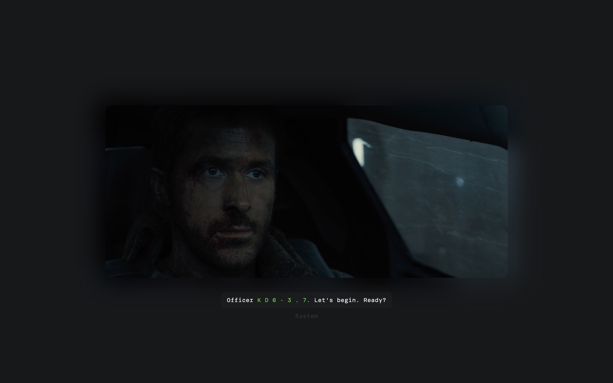

# Web Typography, 2020/2021
In dit korte verslag zal ik mijn ontwerpkeuzes onderbouwen en zal ik sommige gedeeltes van mijn code toelichten.

## De eerste stappen

Om een goed idee te krijgen van de betreffende scene, heb ik in eerste instantie de volledige film gekeken, voordat ik begon met het bedenken van ideeën. De scene was al vrij vroeg in de film te pas gekomen en maakte het op dat moment niet veel duidelijk dan de scene los te zien. Echter wat later in de film en na wat comments te lezen op Reddit en IMDB, werd de scene voor mij behoorlijk duidelijk en heb ik a.d.h.v. deze kennis wat eerste opties opgeschreven.

## Ideeën op papier

Na het kijken van de film en het bekijken van de scene heb ik per audiotoon een aantal opties opgeschreven om te visualiseren. Door meer opties te maken per audiofragment heb ik een bredere keuze om te bepalen wat de definitieve versie wordt. Ook heb ik aan anderen in de klas feedback gevraagd over welke opties het beste zouden kunnen werken per audio moment. 

## Eerste ideeën in code

Uiteindelijk ben ik dus aan de slag gegaan met het uitwerken van de ideeën in code. Om de film visueel groter te maken en om subtiel audio tonen te kunnen uitbeelden, heb ik een ambilight effect (glow met blur) toegevoegd aan de video. Dit effect breekt dus de film met de achtergrond om het subtiel over te laten vloeien. De donkere achtergrond van de website laat dit effect nog mooier naar voren komen en zet de grauwe toon van de film. 

## Visuele elementen

"Fuck Off" vormgegeven als glitch om de gevoelens te tonen van agent K (dat geen mens is, maar toch gevoelens heeft). Het beeld wordt daarna hoog qua contrast om de gevoelens die hij heeft uit te beelden (hij is aan het nadenken of incasseren). Door de glitch dus zowel condensed als dik te maken, laat ik zien dat hij het niet schreeuwerig zegd, maar wel dat het harder aan kan komen. Ook laat ik zo het contrast zien tussen de toon en het bericht.

De scanlines in het tweede gedeelte zijn vormgegeven gelijktijdig met de scanlines in het beeld. Deze zijn gelinkt met de achtergrond muziek om ook direct dit te visualiseren en de toon te zetten van de lange noten. 

Effecten van de warnings en alerts heb ik redelijk subtiel gehouden waar dat nodig was. Maar heb ik wel telkens constant opgehouden met wat blur om consistentie te laten met de blur van de achtergrond. Ook de aspect ratio animeert mee met het geluid aan het begin van de film en aan het eind om aan te duidden wat de soundtrack doet en dit maakt meteen een mooie overgang naar de control buttons mogelijk.

Het effect waar de tension steeds heftiger wordt, wordt dmv een simpele javascript functie beïnvloed. Een simpele counter die telt naar 42 (zolang de scene duurt) en de animatie vermenigvuldigt met deze waarde (een variabale die wordt aangemaakt in html via css). Zo wordt de intensiteit gaandeweg op een optellende manier verhoogd.

## Resultaat

Uiteindelijk ben ik best tevreden met het werk wat ik heb gemaakt. Ik denk zelf dat ik een goede balans heb gevonden tussen het visualiseren van de audio en het intact houden van de visuele stijl van de film zoals de regisseur dat heeft bedoeld. Nu hopen dat de docent die mening deelt en natuurlijk op een mooi cijfer :D.
